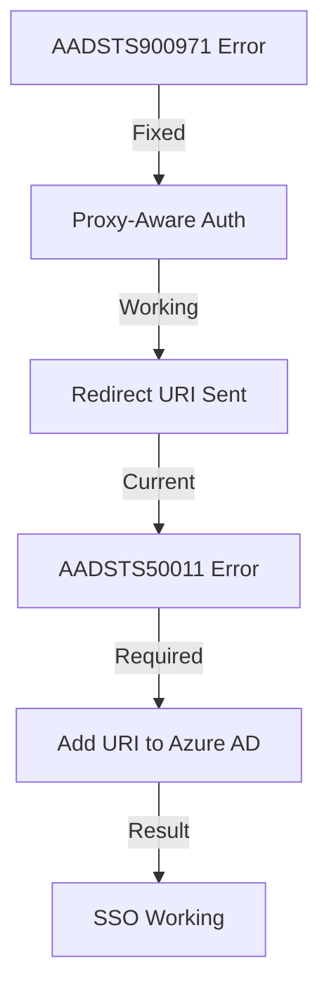

# Bug Report: AADSTS50011 Redirect URI Mismatch

**Date:** November 26, 2025
**Component:** Azure AD SSO Authentication
**Error Code:** AADSTS50011
**Severity:** CRITICAL
**Status:** PENDING AZURE AD CONFIGURATION
**Previous Error:** AADSTS900971 (FIXED)

## Executive Summary

After successfully fixing the AADSTS900971 error with our proxy-aware authentication configuration, we encountered a new error AADSTS50011. This indicates that our fix is working correctly - the application is now properly sending the redirect URI. However, Azure AD doesn't have this exact redirect URI registered for the application.

## Error Details

### User-Facing Error

```
AADSTS50011: The redirect URI 'https://cs-connect-dashboard.netlify.app/api/auth/callback/azure-ad'
specified in the request does not match the redirect URIs configured for the
application 'e4c2a55f-afc5-4b67-9b17-3ee7d73b52d3'.
```

### Error Analysis

- **Application ID:** e4c2a55f-afc5-4b67-9b17-3ee7d73b52d3
- **Redirect URI Being Sent:** https://cs-connect-dashboard.netlify.app/api/auth/callback/azure-ad
- **Issue:** This URI is not registered in Azure AD for the application

## Progress Made

### Previous Fix (AADSTS900971)

✅ **Fixed:** Application wasn't sending redirect_uri parameter
✅ **Solution:** Implemented proxy-aware authentication configuration
✅ **Result:** Redirect URI now being sent correctly

### Current Issue (AADSTS50011)

🔧 **Issue:** Redirect URI is sent but not registered in Azure AD
🔧 **Solution Required:** Add the redirect URI to Azure AD configuration
🔧 **Complexity:** Simple configuration change in Azure Portal

## Root Cause

The authentication flow is now working correctly:

1. User visits https://cs-connect-dashboard.netlify.app
2. Netlify proxies to Vercel backend
3. Our proxy-aware configuration correctly uses NEXTAUTH_URL
4. Application sends correct redirect_uri to Azure AD
5. **Azure AD rejects it because the URI isn't registered** ← Current issue

## Solution Required

### Azure Portal Configuration

Add the following redirect URI to the app registration:

**Primary URI (Required):**

```
https://cs-connect-dashboard.netlify.app/api/auth/callback/azure-ad
```

**Additional URIs (Recommended):**

```
https://cs-connect-dashboard.netlify.app/api/auth/callback/microsoft
https://cs-connect-dashboard.netlify.app/api/auth/signin
```

### Configuration Steps

1. **Navigate to Azure Portal**
   - URL: https://portal.azure.com
   - Go to: Azure Active Directory → App registrations

2. **Find Application**
   - Search for: APAC Intelligence Hub
   - Or use App ID: e4c2a55f-afc5-4b67-9b17-3ee7d73b52d3

3. **Add Redirect URI**
   - Click: Authentication
   - Section: Platform configurations → Web
   - Action: Add URI
   - Paste: `https://cs-connect-dashboard.netlify.app/api/auth/callback/azure-ad`
   - Save changes

4. **Wait for Propagation**
   - Time: 1-3 minutes
   - Azure AD needs time to update across regions

## Testing & Verification

### After Azure AD Update

1. Clear browser cache completely
2. Navigate to: https://cs-connect-dashboard.netlify.app
3. Click "Sign In"
4. Complete Microsoft authentication
5. Verify successful redirect and dashboard loading

### Expected Result

- No more AADSTS50011 error
- Successful authentication flow
- User redirected back to dashboard
- Session established correctly

## Impact Assessment

### Positive Progress

- ✅ Proxy-aware authentication working correctly
- ✅ Redirect URI being sent properly
- ✅ Only Azure AD configuration remaining

### Business Impact

- Users still blocked from accessing application
- Simple fix requiring only Azure AD admin access
- No code changes needed

### Time to Resolution

- Configuration change: 2 minutes
- Propagation time: 1-3 minutes
- Total: ~5 minutes once admin access available

## Technical Analysis

### Authentication Flow Status

| Step                          | Status     | Details                                  |
| ----------------------------- | ---------- | ---------------------------------------- |
| 1. User visits Netlify URL    | ✅ Working | https://cs-connect-dashboard.netlify.app |
| 2. Netlify proxies to Vercel  | ✅ Working | Proxy configuration correct              |
| 3. NextAuth initiates OAuth   | ✅ Working | Using correct NEXTAUTH_URL               |
| 4. Redirect URI sent to Azure | ✅ Working | Sending correct URI                      |
| 5. Azure AD validates URI     | ❌ Failing | URI not registered                       |
| 6. Authentication completes   | ⏸️ Blocked | Waiting for step 5                       |

### Code Status

All necessary code changes have been completed:

- ✅ Proxy-aware authentication configuration
- ✅ Explicit redirect_uri handling
- ✅ Trust host headers enabled
- ✅ Debug logging implemented

## Monitoring

After Azure AD configuration update, monitor for:

- Successful authentication completions
- No AADSTS errors in logs
- Proper session establishment
- Redirect flow completion

## Prevention

To prevent similar issues in the future:

### Documentation

- Maintain list of all required redirect URIs
- Document Azure AD configuration requirements
- Include in deployment checklist

### Process

- Verify Azure AD configuration before domain changes
- Test authentication with all redirect URIs
- Include Azure AD setup in onboarding

### Automation

- Consider using Infrastructure as Code for Azure AD
- Automate redirect URI validation
- Create health checks for OAuth configuration

## Related Issues

- Previous: AADSTS900971 - No redirect URI provided (FIXED)
- Current: AADSTS50011 - Redirect URI mismatch (PENDING)
- Context: Corporate firewall blocking requiring Netlify proxy

## Files Created

1. **AZURE-AD-REDIRECT-URI-FIX.md** - Step-by-step configuration guide
2. **docs/BUG-REPORT-PROXY-AWARE-AUTH-FIX.md** - Previous fix documentation
3. **PROXY-AUTH-VERIFICATION-GUIDE.md** - Testing guide

## Resolution Path



## Summary

**Current Status:** One step away from working SSO
**Action Required:** Add redirect URI to Azure AD
**Complexity:** Simple configuration change
**Time Required:** ~5 minutes
**Code Changes:** None - all code fixes complete

---

**Resolution Status:** PENDING AZURE AD CONFIGURATION
**Next Step:** Admin to add redirect URI in Azure Portal
**Expected Completion:** Immediate once configuration updated
