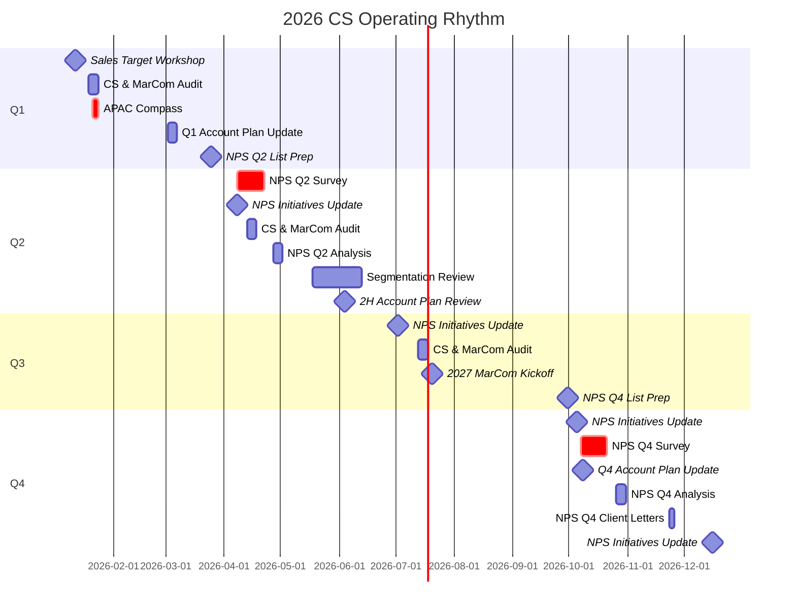
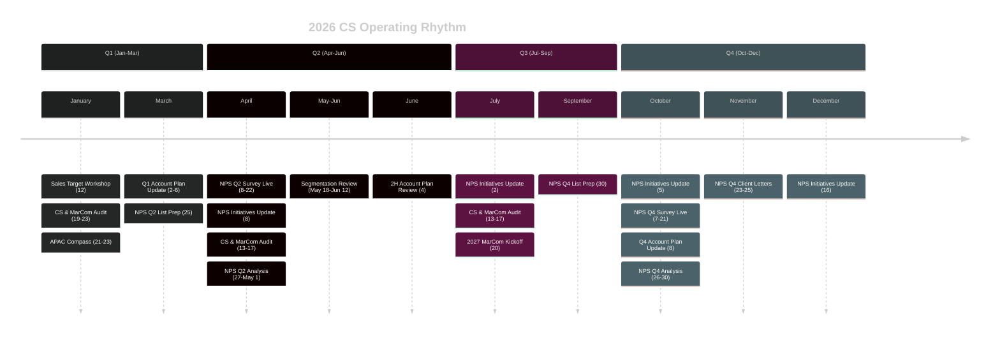

# 2026 CS Operating Rhythm - Visual Design Concept

**Status:** Design Proposal | **Date:** 29 January 2026

---

## Design Philosophy

The operating rhythm should feel like a **living navigation system** rather than a static document. Modern UI/UX trends for 2025-2026 emphasise:

- **Progressive disclosure** — Show summary first, details on demand
- **Bento grid layouts** — Modular, scannable information blocks
- **Timeline-first thinking** — Time is the primary navigation axis
- **Contextual density** — More detail as you zoom in
- **Dark mode native** — Designed for dark-first, light as variant

---

## Visual Concepts

### Concept 1: Annual Orbit View (Recommended)

A **radial/circular calendar** showing the year as a continuous cycle, with events positioned around the circumference.

```
                        JANUARY
                     ╭─────────────╮
                   ╱   🎯 Sales     ╲
            DEC  ╱     Workshop      ╲  FEB
               ╱    📊 APAC Compass    ╲
              │                          │
         NOV  │      2026 OPERATING      │  MAR
              │         RHYTHM           │
              │    ┌──────────────┐      │
         OCT   ╲   │   Current    │    ╱  APR
                ╲  │    Month     │  ╱
            SEP  ╲ └──────────────┘╱  MAY
                   ╲             ╱
                     ╰─────────╯
                        JULY
```

**Why this works:**
- Reinforces the cyclical nature of CS activities
- Current month always highlighted in centre
- Events "orbit" around, showing what's coming
- Clicking an event expands details

**Implementation:** React Flow or D3.js with custom radial layout

---

### Concept 2: Bento Grid Dashboard

A **modular grid** where each cell represents a time period or category, inspired by Apple's iOS widget design.

```
┌─────────────────────────────────────────────────────────────────────────────┐
│                           2026 CS OPERATING RHYTHM                          │
├─────────────────────┬───────────────────────┬───────────────────────────────┤
│                     │                       │                               │
│   📅 THIS MONTH     │   🎯 NEXT EVENT       │      📊 ANNUAL PROGRESS       │
│   ━━━━━━━━━━━━━━    │   ━━━━━━━━━━━━━━━     │      ━━━━━━━━━━━━━━━━━━       │
│                     │                       │                               │
│   January 2026      │   Sales Target        │   ████████░░░░░░░░░░  8%     │
│                     │   Workshop            │                               │
│   3 events          │   Jan 12              │   Events: 3/38 completed     │
│   12 days until     │                       │   NPS: 0/2 surveys           │
│   next milestone    │   ┌─────────────┐     │   Reviews: 0/4 audits        │
│                     │   │ 12 days     │     │                               │
│                     │   └─────────────┘     │                               │
│                     │                       │                               │
├─────────────────────┴───────────────────────┴───────────────────────────────┤
│                                                                             │
│   📆 Q1 TIMELINE                                                            │
│   ━━━━━━━━━━━━━━━━━━━━━━━━━━━━━━━━━━━━━━━━━━━━━━━━━━━━━━━━━━━━━━━━━━━━━━━   │
│                                                                             │
│   JAN ─────●────────●────────────────────────────────────────────────────   │
│            │        │                                                       │
│         Sales    Compass                                                    │
│        Workshop  (21-23)                                                    │
│         (12)                                                                │
│                                                                             │
│   FEB ───────────────────────────────────────────────────────────────────   │
│                                                                             │
│   MAR ────────●──────────────────────────────────────────────────●───────   │
│               │                                                  │          │
│          Q1 Account                                          NPS List      │
│          Plan Update                                         Prep (25)     │
│            (2-6)                                                            │
│                                                                             │
├─────────────────────────────────────────────────────────────────────────────┤
│                                                                             │
│   🏷️ EVENT CATEGORIES                                                       │
│                                                                             │
│   ┌─────────────┐  ┌─────────────┐  ┌─────────────┐  ┌─────────────┐       │
│   │ 📊 NPS      │  │ 📋 Planning │  │ 🔍 Audits   │  │ 📣 MarCom   │       │
│   │ 8 events    │  │ 5 events    │  │ 4 events    │  │ 5 events    │       │
│   └─────────────┘  └─────────────┘  └─────────────┘  └─────────────┘       │
│                                                                             │
└─────────────────────────────────────────────────────────────────────────────┘
```

**Why this works:**
- Scannable at a glance
- Each tile is a "widget" with focused information
- Scales from mobile to large displays
- Natural progressive disclosure

**Implementation:** CSS Grid + Tailwind + Tremor components

---

### Concept 3: Swimlane Timeline

A **horizontal timeline** with parallel swimlanes for different workstreams.

```
                    Q1                    Q2                    Q3                    Q4
           Jan    Feb    Mar    Apr    May    Jun    Jul    Aug    Sep    Oct    Nov    Dec
           ─────────────────────────────────────────────────────────────────────────────────

NPS        ░░░░░░░░░░░░░░░░░░░░░░░██████████░░░░░░░░░░░░░░░░░░░░░░░░░░░░██████████░░░░░░░░░░
                                  │ Q2 Survey│                         │ Q4 Survey│
                                  └──────────┘                         └──────────┘

Planning   ██████░░░░░░██░░░░░░░░░░░░░░░░██░░░░░░░░░░░░░░░░░░░░░░░░░░░░░░██░░░░░░░░░░░░░░░░
           │Compass    │Q1 Update       │2H Review                      │Q4 Update
           └───────────┴────────────────┴───────────────────────────────┴──────────────────

Audits     ░░████░░░░░░░░░░░░████░░░░░░░░░░░░░░████░░░░░░░░░░░░░░░░░░░░░░░░░░░░░░░░░░░░░░░░
             │CS/MarCom       │CS/MarCom       │CS/MarCom
             │Q4 Review       │Q1 Review       │Q2 Review
             └────────────────┴────────────────┴───────────────────────────────────────────

Segment    ████████████████████████████████████████████████████████████████████████████████
           │                    Ongoing Segmentation Activities                           │
           └──────────────────────────────────────────────────────────────────────────────┘
```

**Why this works:**
- Shows parallel workstreams clearly
- Easy to spot conflicts and dependencies
- Familiar Gantt-style mental model
- Good for resource planning

**Implementation:** React Calendar Timeline or Frappe Gantt

---

### Concept 4: Event Cards with Micro-Timeline

Individual **event cards** that expand to show preparation timeline and deliverables.

```
┌─────────────────────────────────────────────────────────────────┐
│  📊 APAC Compass / Annual Account Planning                      │
│  ━━━━━━━━━━━━━━━━━━━━━━━━━━━━━━━━━━━━━━━━━━━━━━━━━━━━━━━━━━━━━  │
│                                                                 │
│  ┌─────────┐                                                    │
│  │ JAN     │  21-23 January 2026                                │
│  │  21-23  │                                                    │
│  └─────────┘                                                    │
│                                                                 │
│  👥 EVP, VP CommOps, AVP CS, CSEs, CAMs                         │
│                                                                 │
│  ┌─────────────────────────────────────────────────────────────┐│
│  │ Preparation Timeline                            [Expand ▼] ││
│  ├─────────────────────────────────────────────────────────────┤│
│  │  T-14d │ Complete client health assessments                 ││
│  │  T-7d  │ Review segmentation assignments                    ││
│  │  T-3d  │ Prepare uncomfortable truths per account           ││
│  │  T-1d  │ Final deck preparation                             ││
│  └─────────────────────────────────────────────────────────────┘│
│                                                                 │
│  📦 Deliverables                                                │
│  ┌──────────────────┐ ┌──────────────────┐ ┌──────────────────┐│
│  │ Annual Account   │ │ Pipeline         │ │ Risk Register    ││
│  │ Plans            │ │ Opportunities    │ │ + Mitigations    ││
│  └──────────────────┘ └──────────────────┘ └──────────────────┘│
│                                                                 │
│  🔗 Tools: Planning Hub • Satisfaction Template • Activity Reg  │
│                                                                 │
└─────────────────────────────────────────────────────────────────┘
```

**Why this works:**
- Self-contained, portable information units
- Natural for print/PDF export
- Can be filtered and sorted
- Works in notification/reminder systems

**Implementation:** Shadcn/ui Card + Collapsible + Tailwind

---

## Recommended Visual Library Stack

### For APAC Intelligence Dashboard Integration (React/Next.js)

| Library | Purpose | Why |
|---------|---------|-----|
| **Tremor** | Charts, KPIs, progress bars | Already in your stack; consistent design language |
| **React Flow** | Orbital/network diagrams | Already in your stack; handles complex layouts |
| **Framer Motion** | Animations, transitions | Smooth micro-interactions; performant |
| **date-fns** | Date calculations | Already in your stack |
| **Lucide Icons** | Consistent iconography | Already in your stack |

### For Standalone Visual Document (Export/Print)

| Library | Purpose | Why |
|---------|---------|-----|
| **React-PDF** | Generate PDF documents | Native React component rendering to PDF |
| **Mermaid.js** | Diagrams in markdown | Can embed in existing docs; version-controlled |
| **Excalidraw** | Hand-drawn style diagrams | Approachable, less "corporate" feel |
| **html-to-image** | Export React components as images | Snapshot any component for sharing |

### For Presentation/Slides

| Library | Purpose | Why |
|---------|---------|-----|
| **Reveal.js** | HTML presentations | Interactive, embeddable, web-native |
| **Slidev** | Markdown-based slides | Developer-friendly; version controlled |
| **Pitch** | Modern presentation tool | Beautiful templates; collaborative |

---

## Implementation Recommendation

### Phase 1: Quick Win (This Week)

Create a **Mermaid.js timeline** that can be embedded directly in markdown and renders in GitHub:



### Phase 2: Dashboard Integration (Next Sprint)

Add a **dedicated Operating Rhythm page** to APAC Intelligence with:

1. **Bento grid overview** (Concept 2)
2. **Horizontal timeline** with quarter tabs
3. **Event detail modals** (Concept 4)
4. **Personal reminders** tied to user role

### Phase 3: Advanced Visualisation (Future)

Build the **Orbital View** (Concept 1) as an interactive centrepiece showing:
- Current position in the year
- Upcoming events radiating outward
- Click-through to event details
- Export to calendar (ICS)

---

## Visual Style Guide

### Colour Palette (Dark Mode First)

```
Background:    #0a0a0a (near-black)
Surface:       #18181b (zinc-900)
Border:        #27272a (zinc-800)
Text Primary:  #fafafa (zinc-50)
Text Muted:    #a1a1aa (zinc-400)

Accent - NPS:       #f59e0b (amber-500)
Accent - Planning:  #3b82f6 (blue-500)
Accent - Audit:     #8b5cf6 (violet-500)
Accent - MarCom:    #ec4899 (pink-500)
Accent - Segment:   #10b981 (emerald-500)
```

### Typography

```
Headings:    Inter (Variable), weight 600-700
Body:        Inter (Variable), weight 400-500
Mono/Data:   JetBrains Mono, weight 400
```

### Spacing System

```
Base unit: 4px
Card padding: 24px (6 units)
Grid gap: 16px (4 units)
Section margin: 48px (12 units)
```

---

## Next Steps

1. **Decide on primary format**: Dashboard page vs standalone document vs both
2. **Choose visual concept**: Orbital, Bento, Swimlane, or hybrid
3. **Prioritise interactivity**: Static export vs live filtering
4. **Define user stories**: Who views this, when, and why?

---

## Appendix: Mermaid Timeline (Ready to Use)

Copy this into any markdown file that supports Mermaid rendering:



---

*Design document prepared for CS Leadership review.*
